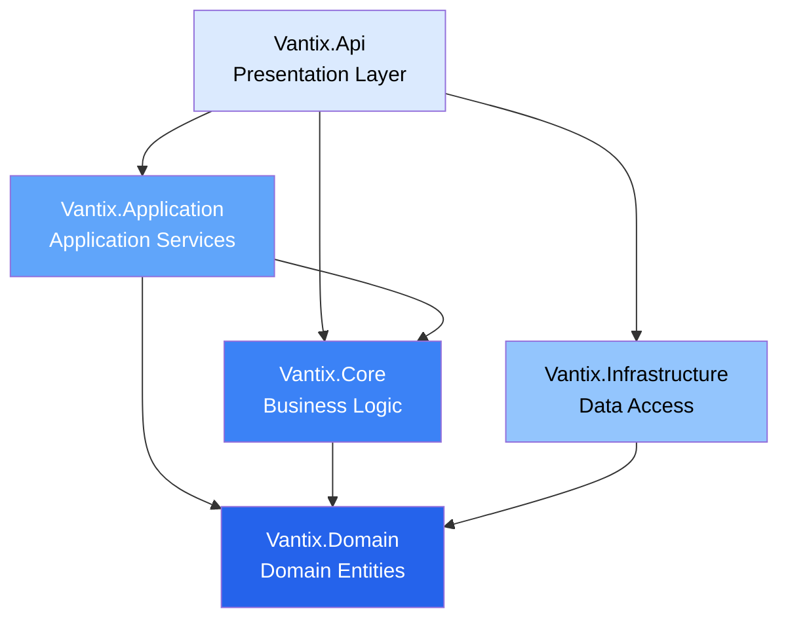

## Introduction

Vantix Sales API is built using **Clean Architecture** principles, ensuring a maintainable, testable, and scalable solution for managing sales operations. The architecture separates concerns into distinct layers, each with specific responsibilities and dependencies flowing inward.

## Why Clean Architecture?

Clean Architecture was chosen for Vantix to achieve:

<CardGroup cols={2}>
  <Card title="Independence" icon="circle-nodes">
    Business logic remains independent of frameworks, UI, and databases
  </Card>
  <Card title="Testability" icon="vial">
    Business rules can be tested without external dependencies
  </Card>
  <Card title="Maintainability" icon="wrench">
    Clear separation makes code easier to understand and modify
  </Card>
  <Card title="Flexibility" icon="arrows-rotate">
    Easy to swap infrastructure components without affecting business logic
  </Card>
</CardGroup>

## Architecture Layers

The Vantix solution is organized into five distinct projects, each representing a layer in the Clean Architecture:



### Layer Descriptions

<Steps>
  <Step title="Domain Layer (Vantix.Domain)">
    Contains the core business entities and domain models. This layer has **no dependencies** on other projects.
    
    **Responsibilities:**
    - Define entity models (e.g., `Clientes`)
    - Domain value objects
    - Domain exceptions
    
    **Technology:** .NET 10.0, Entity Framework Core 10.0.3
  </Step>
  
  <Step title="Core Layer (Vantix.Core)">
    Houses the business logic and use cases. Depends only on the Domain layer.
    
    **Responsibilities:**
    - Business rules and validations
    - Use case implementations
    - Business interfaces
    
    **Technology:** .NET 10.0
  </Step>
  
  <Step title="Application Layer (Vantix.Application)">
    Contains application-specific business rules and orchestrates the flow of data.
    
    **Responsibilities:**
    - Application services
    - DTOs (Data Transfer Objects)
    - Service interfaces
    - Mapping configurations
    
    **Technology:** .NET 10.0
  </Step>
  
  <Step title="Infrastructure Layer (Vantix.Infrastructure)">
    Implements data access and external service integrations. Depends on the Domain layer.
    
    **Responsibilities:**
    - Database context (`VantixDbContext`)
    - Repository implementations
    - Entity configurations
    - External API integrations
    
    **Technology:** .NET 10.0, Entity Framework Core 10.0.3, SQL Server
  </Step>
  
  <Step title="API Layer (Vantix.Api)">
    The presentation layer that exposes HTTP endpoints. This is the entry point for external clients.
    
    **Responsibilities:**
    - Controllers and endpoints
    - Request/response handling
    - Dependency injection configuration
    - Middleware setup
    
    **Technology:** .NET 10.0, ASP.NET Core, OpenAPI
  </Step>
</Steps>

## Dependency Flow

The dependency rule is fundamental to Clean Architecture:

<Note>
  **The Dependency Rule**: Source code dependencies must point **inward** only. Inner layers know nothing about outer layers.
</Note>

```
Vantix.Api ────────────────────┐
  │                            │
  ├──> Vantix.Application      │
  │      │                     │
  │      └──> Vantix.Core      │
  │             │              │
  └──> Vantix.Infrastructure   │
         │                     │
         └─────────────────────┴──> Vantix.Domain
```

## Design Goals

<CardGroup cols={3}>
  <Card title="Modularity" icon="cube">
    Each layer has a single, well-defined responsibility
  </Card>
  <Card title="Scalability" icon="chart-line">
    Architecture supports horizontal and vertical scaling
  </Card>
  <Card title="Maintainability" icon="code">
    Clean separation enables easier updates and bug fixes
  </Card>
  <Card title="Testability" icon="flask">
    Business logic can be tested in isolation
  </Card>
  <Card title="Database Agnostic" icon="database">
    Business logic doesn't depend on database implementation
  </Card>
  <Card title="Framework Independence" icon="shield">
    Core business rules aren't tied to any framework
  </Card>
</CardGroup>

## Technology Stack

The Vantix Sales API is built on modern .NET technologies:

- **.NET 10.0**: The latest long-term support version of .NET
- **Entity Framework Core 10.0.3**: For database operations and ORM
- **ASP.NET Core**: Web API framework
- **SQL Server**: Primary database
- **OpenAPI**: API documentation and specification

## Benefits Realized

<Tip>
  By following Clean Architecture, Vantix achieves:
  - **Easy testing** of business logic without database dependencies
  - **Simple database migrations** using Entity Framework scaffolding
  - **Clear project organization** making onboarding easier
  - **Future-proof design** allowing technology changes without core rewrites
</Tip>

## Next Steps

<CardGroup cols={2}>
  <Card title="Clean Architecture Details" icon="layer-group" href="/architecture/clean-architecture">
    Deep dive into how Clean Architecture is implemented
  </Card>
  <Card title="Project Structure" icon="folder-tree" href="/architecture/project-structure">
    Detailed breakdown of each project and its components
  </Card>
</CardGroup>