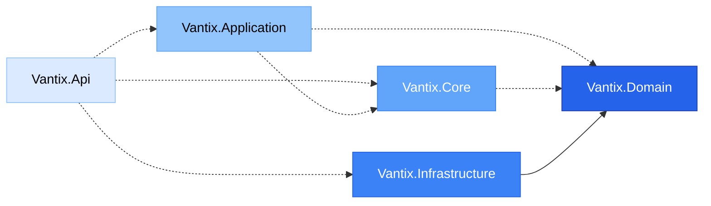

## Solution Overview

The Vantix Sales API solution consists of five projects organized in a Clean Architecture pattern. Each project has a specific role and set of responsibilities.

```xml SistemasVentasV2Angular.slnx
<Solution>
  <Folder Name="/Vantix/">
    <Project Path="Vantix.Api/Vantix.Api.csproj" />
    <Project Path="Vantix.Application/Vantix.Application.csproj" />
    <Project Path="Vantix.Domain/Vantix.Domain.csproj" />
    <Project Path="Vantix.Infrastructure/Vantix.Infrastructure.csproj" />
    <Project Path="Vantix.Core/Vantix.Core.csproj" />
  </Folder>
</Solution>
```

## Project Breakdown

### Vantix.Api - Presentation Layer

The API project is the entry point for all HTTP requests and serves as the presentation layer.

<CodeGroup>
```xml Project Configuration
<Project Sdk="Microsoft.NET.Sdk.Web">
  <PropertyGroup>
    <TargetFramework>net10.0</TargetFramework>
    <Nullable>enable</Nullable>
    <ImplicitUsings>enable</ImplicitUsings>
  </PropertyGroup>

  <ItemGroup>
    <PackageReference Include="Microsoft.AspNetCore.OpenApi" Version="10.0.3" />
  </ItemGroup>
</Project>
```

```csharp Program.cs
var builder = WebApplication.CreateBuilder(args);

// Add services to the container.
builder.Services.AddControllers();
builder.Services.AddOpenApi();

var app = builder.Build();

// Configure the HTTP request pipeline.
if (app.Environment.IsDevelopment())
{
    app.MapOpenApi();
}

app.UseHttpsRedirection();
app.UseAuthorization();
app.MapControllers();

app.Run();
```
</CodeGroup>

**Directory Structure:**
```
Vantix.Api/
├── Controllers/          # API controllers
├── Properties/          # Launch settings and properties
├── Program.cs           # Application entry point and configuration
├── appsettings.json     # Application configuration
└── Vantix.Api.csproj   # Project file
```

**Key Responsibilities:**
- Define HTTP endpoints via controllers
- Handle request/response serialization
- Configure middleware pipeline
- Set up dependency injection
- Configure OpenAPI/Swagger documentation
- Manage authentication and authorization

**Technologies:**
- ASP.NET Core Web API
- Microsoft.AspNetCore.OpenApi 10.0.3
- .NET 10.0

<Tip>
  The API layer should contain minimal business logic. Its primary role is to receive requests, delegate to services, and return responses.
</Tip>

---

### Vantix.Application - Application Services Layer

The Application layer orchestrates the flow of data and coordinates between the presentation and domain layers.

```xml Vantix.Application.csproj
<Project Sdk="Microsoft.NET.Sdk">
  <PropertyGroup>
    <TargetFramework>net10.0</TargetFramework>
    <ImplicitUsings>enable</ImplicitUsings>
    <Nullable>enable</Nullable>
  </PropertyGroup>
</Project>
```

**Directory Structure:**
```
Vantix.Application/
├── DTOs/               # Data Transfer Objects
├── Interfaces/         # Service interfaces
├── Services/          # Application service implementations
├── Mapping/           # AutoMapper profiles
└── Vantix.Application.csproj
```

**Key Responsibilities:**
- Implement application services
- Define DTOs for data transfer
- Handle data transformation and mapping
- Coordinate use cases
- Implement cross-cutting concerns (validation, caching)

**Dependencies:**
- `Vantix.Core` - For business logic
- `Vantix.Domain` - For domain entities

<Info>
  The Application layer is where you implement specific use cases like "Register New Client" or "Process Sale Transaction".
</Info>

---

### Vantix.Core - Business Logic Layer

The Core layer contains the pure business logic and rules that are independent of any framework or infrastructure.

```xml Vantix.Core.csproj
<Project Sdk="Microsoft.NET.Sdk">
  <PropertyGroup>
    <TargetFramework>net10.0</TargetFramework>
    <ImplicitUsings>enable</ImplicitUsings>
    <Nullable>enable</Nullable>
  </PropertyGroup>
</Project>
```

**Directory Structure:**
```
Vantix.Core/
├── BusinessRules/     # Business validation rules
├── Interfaces/        # Core business interfaces
├── Services/         # Business logic services
└── Vantix.Core.csproj
```

**Key Responsibilities:**
- Implement business rules and validations
- Define business logic interfaces
- Contain domain services
- Enforce business constraints
- Calculate business values

**Dependencies:**
- `Vantix.Domain` only

<Warning>
  The Core layer must remain **completely independent** of infrastructure concerns. No database, no HTTP, no file system - only pure business logic.
</Warning>

---

### Vantix.Domain - Domain Entities Layer

The Domain layer is the innermost layer containing the core business entities and value objects.

<CodeGroup>
```xml Project Configuration
<Project Sdk="Microsoft.NET.Sdk">
  <PropertyGroup>
    <TargetFramework>net10.0</TargetFramework>
    <ImplicitUsings>enable</ImplicitUsings>
    <Nullable>enable</Nullable>
  </PropertyGroup>

  <ItemGroup>
    <Folder Include="Entities\Models\" />
  </ItemGroup>

  <ItemGroup>
    <PackageReference Include="Microsoft.EntityFrameworkCore.Design" Version="10.0.3">
      <PrivateAssets>all</PrivateAssets>
      <IncludeAssets>runtime; build; native; contentfiles; analyzers; buildtransitive</IncludeAssets>
    </PackageReference>
    <PackageReference Include="Microsoft.EntityFrameworkCore.SqlServer" Version="10.0.3" />
  </ItemGroup>
</Project>
```

```csharp Clientes Entity
using System;
using System.Collections.Generic;

namespace Vantix.Domain.Entities.Models;

public partial class Clientes
{
    public int ClienteId { get; set; }

    public string Nombre { get; set; } = null!;

    public string Apellido { get; set; } = null!;

    public string DocumentoIdentidad { get; set; } = null!;

    public string? Email { get; set; }

    public string? Telefono { get; set; }

    public DateTime? FechaRegistro { get; set; }

    public bool? Activo { get; set; }
}
```
</CodeGroup>

**Directory Structure:**
```
Vantix.Domain/
├── Entities/
│   └── Models/          # Domain entity models
│       └── Clientes.cs  # Client entity
├── ValueObjects/        # Domain value objects
└── Vantix.Domain.csproj
```

**Key Responsibilities:**
- Define core business entities
- Contain domain value objects
- Define domain events
- House domain exceptions

**Dependencies:**
- **NONE** - This layer is completely independent

<Note>
  Entity classes like `Clientes` are generated via EF Core scaffolding and placed in this layer to maintain domain independence.
</Note>

---

### Vantix.Infrastructure - Data Access Layer

The Infrastructure layer handles all external dependencies including database access, file systems, and third-party APIs.

<CodeGroup>
```xml Project Configuration
<Project Sdk="Microsoft.NET.Sdk">
  <PropertyGroup>
    <TargetFramework>net10.0</TargetFramework>
    <ImplicitUsings>enable</ImplicitUsings>
    <Nullable>enable</Nullable>
  </PropertyGroup>

  <ItemGroup>
    <PackageReference Include="Microsoft.EntityFrameworkCore" Version="10.0.3" />
    <PackageReference Include="Microsoft.EntityFrameworkCore.Design" Version="10.0.3">
      <PrivateAssets>all</PrivateAssets>
      <IncludeAssets>runtime; build; native; contentfiles; analyzers; buildtransitive</IncludeAssets>
    </PackageReference>
    <PackageReference Include="Microsoft.EntityFrameworkCore.SqlServer" Version="10.0.3" />
    <PackageReference Include="Microsoft.EntityFrameworkCore.Tools" Version="10.0.3">
      <PrivateAssets>all</PrivateAssets>
      <IncludeAssets>runtime; build; native; contentfiles; analyzers; buildtransitive</IncludeAssets>
    </PackageReference>
  </ItemGroup>

  <ItemGroup>
    <Folder Include="Persistence\" />
  </ItemGroup>

  <ItemGroup>
    <ProjectReference Include="..\Vantix.Domain\Vantix.Domain.csproj" />
  </ItemGroup>
</Project>
```

```csharp VantixDbContext.cs
using System;
using System.Collections.Generic;
using Microsoft.EntityFrameworkCore;
using Vantix.Domain.Entities.Models;

namespace Vantix.Infrastructure.Persistence;

public partial class VantixDbContext : DbContext
{
    public VantixDbContext()
    {
    }

    public VantixDbContext(DbContextOptions<VantixDbContext> options)
        : base(options)
    {
    }

    public virtual DbSet<Clientes> Clientes { get; set; }

    protected override void OnModelCreating(ModelBuilder modelBuilder)
    {
        modelBuilder.Entity<Clientes>(entity =>
        {
            entity.HasKey(e => e.ClienteId)
                .HasName("PK__Clientes__71ABD0872790C1F1");

            entity.HasIndex(e => e.DocumentoIdentidad, "UQ__Clientes__049E81A9FF79380A")
                .IsUnique();

            entity.Property(e => e.Activo).HasDefaultValue(true);
            entity.Property(e => e.Apellido).HasMaxLength(100);
            entity.Property(e => e.DocumentoIdentidad).HasMaxLength(20);
            entity.Property(e => e.Email).HasMaxLength(150);
            entity.Property(e => e.FechaRegistro)
                .HasDefaultValueSql("(getdate())")
                .HasColumnType("datetime");
            entity.Property(e => e.Nombre).HasMaxLength(100);
            entity.Property(e => e.Telefono).HasMaxLength(20);
        });

        OnModelCreatingPartial(modelBuilder);
    }

    partial void OnModelCreatingPartial(ModelBuilder modelBuilder);
}
```
</CodeGroup>

**Directory Structure:**
```
Vantix.Infrastructure/
├── Persistence/
│   └── VantixDbContext.cs  # EF Core DbContext
├── Repositories/            # Repository implementations
├── ExternalServices/        # Third-party integrations
└── Vantix.Infrastructure.csproj
```

**Key Responsibilities:**
- Implement data access with Entity Framework Core
- Provide repository implementations
- Handle database migrations
- Integrate with external APIs
- Implement caching strategies
- Manage file system operations

**Dependencies:**
- `Vantix.Domain` - For entity definitions

**Technologies:**
- Entity Framework Core 10.0.3
- SQL Server provider
- EF Core Tools for migrations

<Tip>
  The `VantixDbContext` references domain entities from `Vantix.Domain.Entities.Models`, maintaining proper dependency flow.
</Tip>

---

## Database Scaffolding

Vantix uses Entity Framework Core scaffolding to generate entities and context from an existing database:

```batch scaffold.bat
@echo off
echo 🚀 Generando modelos en Domain e Infraestructura...

dotnet ef dbcontext scaffold "Server=GARIEN-DESKTOP;Database=VantixV1;Trusted_Connection=True;TrustServerCertificate=true;" Microsoft.EntityFrameworkCore.SqlServer ^
  --project Vantix.Infrastructure ^
  --output-dir ../Vantix.Domain/Entities/Models ^
  --context-dir Persistence ^
  --context VantixDbContext ^
  --force ^
  --no-pluralize ^
  --namespace Vantix.Domain.Entities.Models ^
  --context-namespace Vantix.Infrastructure.Persistence

echo ✅ ¡Revisa tus carpetas ahora!
pause
```

**What This Does:**

<Steps>
  <Step title="Connects to Database">
    Reads the schema from the SQL Server database `VantixV1`
  </Step>
  
  <Step title="Generates Entities">
    Creates entity classes in `Vantix.Domain/Entities/Models/` with namespace `Vantix.Domain.Entities.Models`
  </Step>
  
  <Step title="Generates DbContext">
    Creates `VantixDbContext` in `Vantix.Infrastructure/Persistence/` with namespace `Vantix.Infrastructure.Persistence`
  </Step>
  
  <Step title="Maintains Clean Architecture">
    Ensures entities are in the Domain layer and context is in the Infrastructure layer
  </Step>
</Steps>

<Info>
  The `--force` flag overwrites existing files, making it easy to sync with database schema changes.
</Info>

## Project Dependencies Diagram



<Note>
  Solid arrows (→) represent **project references** in .csproj files. Dashed arrows (-.→) represent runtime dependencies configured via dependency injection.
</Note>

## Technology Stack by Project

| Project | Framework | Key Packages | Target |
|---------|-----------|--------------|--------|
| **Vantix.Api** | ASP.NET Core Web API | Microsoft.AspNetCore.OpenApi 10.0.3 | .NET 10.0 |
| **Vantix.Application** | Class Library | - | .NET 10.0 |
| **Vantix.Core** | Class Library | - | .NET 10.0 |
| **Vantix.Domain** | Class Library | EF Core Design 10.0.3, EF Core SQL Server 10.0.3 | .NET 10.0 |
| **Vantix.Infrastructure** | Class Library | EF Core 10.0.3, EF Core Tools 10.0.3, EF Core SQL Server 10.0.3 | .NET 10.0 |

## Common Patterns

<CardGroup cols={2}>
  <Card title="Repository Pattern" icon="database">
    Implemented in `Vantix.Infrastructure` to abstract data access from business logic
  </Card>
  <Card title="Dependency Injection" icon="plug">
    All services registered in `Program.cs` and injected via constructors
  </Card>
  <Card title="DTO Pattern" icon="arrow-right-arrow-left">
    Used in `Vantix.Application` to transfer data between layers
  </Card>
  <Card title="Unit of Work" icon="list-check">
    Coordinated through `VantixDbContext` to manage transactions
  </Card>
</CardGroup>

## Next Steps

<CardGroup cols={2}>
  <Card title="Architecture Overview" icon="sitemap" href="/architecture/overview">
    Understanding the high-level architecture
  </Card>
  <Card title="Clean Architecture" icon="layer-group" href="/architecture/clean-architecture">
    Deep dive into Clean Architecture implementation
  </Card>
</CardGroup>